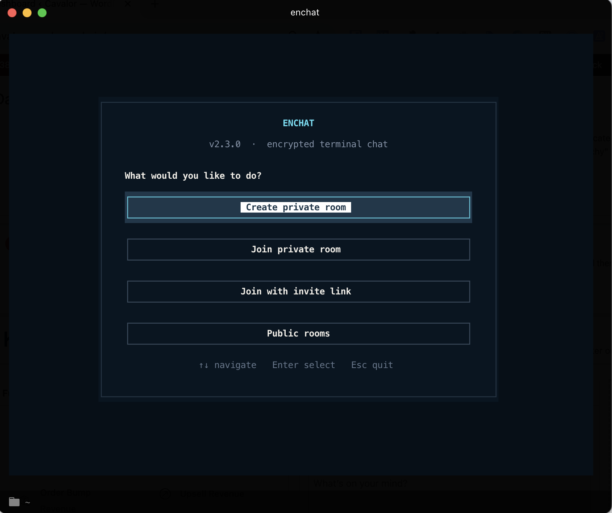
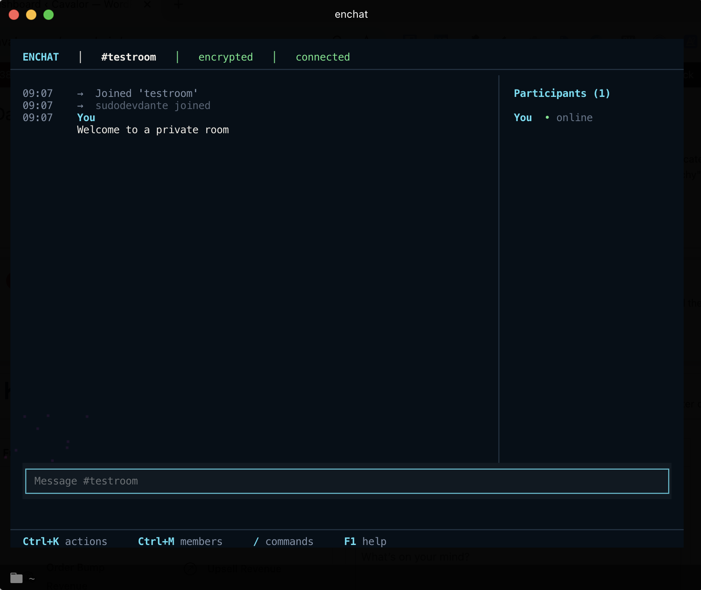

<div align="center">
  
</div>

# 🔐 Enchat - Encrypted Under The Radar Terminal Chat
<div align="center">
  <b><a href="https://enchat.io">Website</a></b> •
  <b><a href="https://github.com/sudodevdante/enchat">GitHub</a></b>
</div>

[](https://www.python.org/downloads/)

**Enchat** brings **end-to-end encrypted communication** directly to your terminal, enabling completely private conversations without corporate surveillance or data harvesting. Built on a zero-trust architecture, Enchat ensures that your messages are cryptographically protected and invisible to servers, governments, and eavesdroppers.

**Why Enchat?** Because your privacy deserves better. Take back control with a tool that's truly private by design—no accounts, no tracking, no compromises.

## ✨ Core Features
- **Real-Time Encrypted Chat:** Secure, real-time messaging with timestamps and user presence indicators.
- **Keyboard-First Interface:** Responsive terminal layout, editable composer, command suggestions, action palette, and collapsible participant list.
- **Ephemeral Public Rooms:** Anyone can create a discoverable public room; it remains listed while participants are active and expires automatically afterward.
- **Secure Room & File Sharing:** Invite users with temporary, zero-knowledge links and share files with end-to-end encryption.
- **Atomic Encrypted Messages:** Each message carries everything needed for decryption inside one authenticated room-key envelope, avoiding key-synchronization races.
- **Tor Support:** Enhance your anonymity by routing all traffic through the Tor network.
- **Zero-Knowledge Architecture:** Servers act as blind message relays and have zero knowledge of your message content, files, or room passphrases.
- **Cross-Platform:** A consistent and powerful terminal experience on macOS, Linux, and Windows.

---

## 🚀 Quick Start

### Installation
The recommended installation method uses our `install.sh` script, which automatically handles dependencies and sets up a global `enchat` command.

```bash
# Clone the repository
git clone https://github.com/sudodevdante/enchat.git
cd enchat

# Run the installer (feel free to inspect it first)
./install.sh
```
*For manual installation instructions, see the repository wiki.*

### Ways to Start Enchat

| Command | Description |
|---|---|
| `enchat` | Open the keyboard-first Home screen. |
| `enchat run` | Immediately reopen the saved room. |
| `enchat join-link <url>` | Join a room directly using a secure invitation link. |
| `enchat public [name]` | Join an active public room from the directory. |
| `enchat reset` | Resets all saved room configurations. |
| `enchat kill` | Securely wipes all Enchat data from your device. |

### Creating or Joining a Room
Run `enchat` to open Home. From there you can continue a saved room, create or
join a private room, paste an invite link, or browse public rooms. Room forms
support Tab/Enter/Esc navigation, masked passphrases, validation, and an
optional advanced relay selector.

Public rooms can be created directly from Home. Each room receives a random
internal relay topic and a temporary directory lease. Every connected client
renews that lease; roughly two minutes after the last participant leaves, the
room disappears from discovery.

```bash
enchat
```
You will be guided through setting a room name, a nickname, and a strong encryption passphrase.

### Joining with an Invitation Link
If you've received a secure link, use the `join-link` command:
```bash
enchat join-link "https://share.enchat.io/join#session-id:key-material"
```

<div align="center">
  
  <br><br>
  
</div>

---

## 🤝 Sharing & Collaboration

Enchat provides powerful, secure tools for inviting users and sharing files without compromising on privacy.

### Inviting Users to Private Rooms (Securely & Easily)
Forget manually sharing secret passphrases. Enchat's link-sharing system allows you to generate temporary, secure invitation links.

**How it Works (Zero-Knowledge Architecture):**
1.  You run `/share-room`.
2.  Your client **locally encrypts** the room's credentials (name + passphrase) with a new, single-use key.
3.  This encrypted data is sent to the link server (`share.enchat.io`).
4.  The secret key is appended to the URL after a `#` (a URL fragment), which **never leaves your client**.
5.  When a new user joins with the link, their client fetches the encrypted blob and uses the key from the URL fragment to decrypt it locally.

The server only ever stores an encrypted, meaningless blob of data, making the entire process **zero-knowledge**.

#### **1. Generate the Link**
Use the `/share-room` command. You can control the link's lifetime (`--ttl`) and number of uses (`--uses`). The generated link will be displayed in a panel.
```bash
> /share-room --uses 2 --ttl 1h
```

#### **2. Copy the Link**
A confirmation panel will appear. To prevent copy-paste errors with long URLs, simply use the `/copy-link` command.
```bash
> /copy-link
```

### Sharing Files Securely
Share documents, images, and other files with the same end-to-end encryption used for messages.

-   **End-to-End Encrypted:** Files are encrypted into small chunks on your machine before being sent.
-   **Zero Server Knowledge:** The server only sees encrypted data, never the file's content or its name.
-   **Integrity Verification:** A SHA256 hash check ensures files are delivered without corruption.

---

## Enhance your development workflows

Enchat is designed to integrate seamlessly into your development process. Use it to collaborate with colleagues, share code snippets, and transfer files without ever leaving the terminal.

---

## ⌨️ All In-Chat Commands

| Command | Description | Example |
|---|---|---|
| **Room & Sharing** | | |
| `/share-room` | Generate a secure, temporary link to invite users. | `/share-room --uses 1 --ttl 10m` |
| `/copy-link` | Copy the last generated room link to the clipboard. | `/copy-link` |
| `/who` | List all users currently in the room. | `/who` |
| `/server` | Display the status of the connected message server. | `/server` |
| `/exit` | Gracefully leave the chat and exit Enchat. | `/exit` |
| **File Transfers** | | |
| `/share` | Securely share a file with the room. | `/share ~/documents/report.pdf` |
| `/files` | List all files available for download. | `/files` |
| `/download` | Download a file by its ID. | `/download a1b2c3d4` |
| **Utilities** | | |
| `/help` | Show the help message with all available commands. | `/help` |
| `/clear` | Clear all messages from the terminal window. | `/clear` |
| `/clean-chat` | Clean chat history for all participants (private rooms only). | `/clean-chat` |
| `/security` | Display an overview of the current security settings. | `/security` |
| `/notifications` | Toggle desktop notifications on or off. | `/notifications` |
| **Fun & Polls** | | |
| `/lottery <cmd>` | Run a lottery (`start`, `enter`, `draw`, `status`, `cancel`). | `/lottery start` |
| `/poll` | Create a poll for the room. | `/poll "Q?" \| "Opt1" \| "Opt2"` |
| `/vote` | Cast your vote in an active poll. | `/vote 1` |

### Keyboard shortcuts

| Shortcut | Action |
|---|---|
| `Ctrl+K` | Open the action palette. |
| `Ctrl+M` | Show or hide participants. |
| `F1` | Open help. |
| `Ctrl+Q` | Leave the current chat. |

---

## 🔒 Security Deep Dive

Enchat is built on a foundation of **defense-in-depth** and **zero-trust** principles.

- **End-to-End Encryption:** Fernet authenticated encryption protects message and file contents between room participants.
- **Key Derivation:** `PBKDF2-HMAC-SHA256` with 480,000 iterations derives the room key from its passphrase.
- **Atomic Wire Protocol:** Protocol v2 encrypts each complete message directly under the derived room key. Legacy session-key messages remain readable during migration, but new messages no longer depend on a separately delivered key event.
- **Server Blindness:** The `ntfy` relay cannot decrypt message contents, usernames inside encrypted payloads, or file contents.
- **Metadata Limits:** The relay can still observe network metadata such as IP addresses, timing, traffic volume, and the room topic used for routing.
- **Public Room Boundary:** Public-room directory credentials are intentionally available to Enchat clients. Public rooms prevent casual relay inspection but provide no membership secrecy, trusted identity, or protection against a malicious participant.
- **Privacy Cleanup:** The `/clean-chat` command signals connected participants to clear their local chat view. Encrypted relay data expires according to the relay's retention policy.
- **Local Cleanup:** The `enchat kill` command performs best-effort removal of local configuration, logs, and downloaded content. Storage hardware and operating systems may retain recoverable copies.

### Message Flow Security
```
Your Message → [Room Key Encrypt] → Authenticated Blob → ntfy Server → Authenticated Blob → [Room Key Decrypt] → Recipient
```
Enchat's protocol has not yet received a formal external security audit. Treat its guarantees as implementation claims that still require independent review.

---

## 🔧 For Developers

### Self-Hosting
For maximum security and control, you can self-host your own `ntfy.sh` message server. While you can configure a server manually, this repository includes an automated script to make it easy.

On a fresh Debian or Ubuntu server, simply run:
```bash
# Downloads and executes the setup script
wget -O - https://raw.githubusercontent.com/sudodevdante/enchat/master/setup-selfhosted-ntfy-server.sh | bash
```
This script will install Docker, configure `ntfy`, set up SSL with Let's Encrypt, and harden the server for production use. Once complete, just point Enchat to your own domain during the initial setup.

### Codebase
The code is designed to be readable and auditable. We encourage security researchers to review the implementation and report any potential vulnerabilities.
-   **`enchat.py`**: Main application entry point and UI handler.
-   **`enchat_lib/`**: Core logic for the application.
    -   `crypto.py`: Handles all encryption, decryption, and key derivation.
    -   `network.py`: Manages connections, message listeners, and the outbox queue.
    -   `commands.py`: Implements all `/` command logic.
    -   `file_transfer.py`: Manages secure file chunking, transfer, and reassembly.
    -   `link_sharing.py`: Powers the zero-knowledge room invitation system.
-   **`install.sh`**: The installer script for easy setup.
-   **`requirements.txt`**: A list of all Python dependencies.

Your contributions are welcome! Please open a GitHub issue to discuss any proposed changes.

---

## ❤️ Donate & Support
Enchat is a free, open-source project developed in my spare time. If you find it useful, please consider supporting its development. Your support helps cover server costs and allows me to dedicate more time to new features and security audits.

<a href='https://ko-fi.com/W7W31GIAJM' target='_blank'></a>

---

## 💼 Professional Services

Need help with enchat? I offer paid consulting for:

- **Custom enchat solutions** and feature development
- **Custom commands** and functionality
- **Server setup** and deployment assistance  
- **General enchat consulting** and advice

**Contact**: [info@enchat.io](mailto:info@enchat.io) for rates and availability.

---

## 📜 License
Copyright © 2025 sudodevdante. All rights reserved.

Permission is granted to any user to install and execute this Software for personal and internal non-commercial use only.

Commercial use — including use by companies, organizations, or any for-profit entities — is strictly prohibited without prior written permission and a valid commercial license from the copyright holder.

Redistribution, modification, decompilation, or any other use is also prohibited without prior written consent.

THIS SOFTWARE IS PROVIDED "AS IS", WITHOUT WARRANTY OF ANY KIND, EXPRESS OR IMPLIED, INCLUDING BUT NOT LIMITED TO THE WARRANTIES OF MERCHANTABILITY, FITNESS FOR A PARTICULAR PURPOSE, AND NON-INFRINGEMENT.

For commercial use or enterprise licensing, please contact info@enchat.io for pricing and terms.
